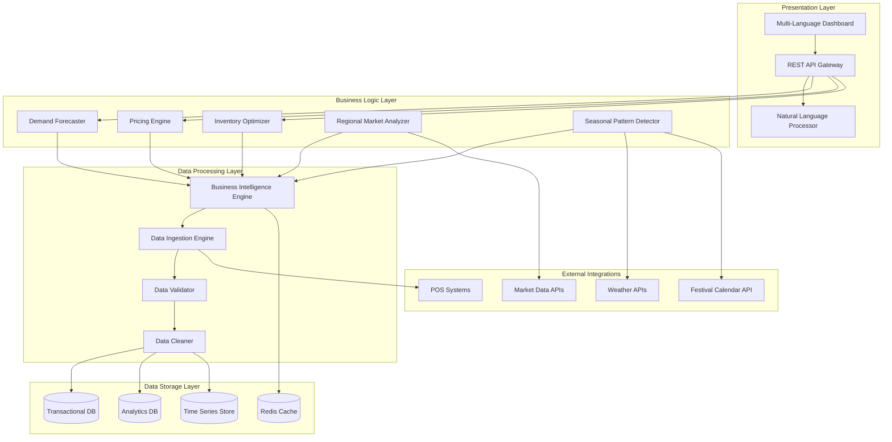

# Design Document: AI-Powered Retail Decision Support System

## Overview

The AI-Powered Retail Decision Support System is a cloud-based platform specifically designed for small and medium retail businesses in India. The system leverages machine learning algorithms to analyze historical sales data, seasonal demand patterns, and regional market trends to provide actionable business insights.

The architecture follows a microservices approach with clear separation between data ingestion, analytics processing, and user interface layers. The system prioritizes simplicity and accessibility for non-technical users while maintaining the sophistication needed for accurate AI-driven predictions.

Key design principles:
- **User-Centric**: Interface designed for shop owners with limited technical expertise
- **Culturally Aware**: Deep understanding of Indian retail patterns, festivals, and regional variations
- **Scalable**: Handles growing data volumes as businesses expand
- **Cost-Effective**: Optimized for small business budgets with tiered pricing
- **Actionable**: Every insight includes clear business recommendations

## Architecture

The system uses a layered microservices architecture deployed on cloud infrastructure:



### Architecture Rationale

**Microservices Design**: Each component (forecasting, pricing, inventory) operates independently, allowing for targeted scaling and easier maintenance. This is crucial for small businesses that may need different levels of functionality.

**Layered Approach**: Clear separation between presentation, business logic, and data layers ensures maintainability and allows for future enhancements without disrupting core functionality.

**Cloud-Native**: Leverages cloud infrastructure for scalability and cost-effectiveness, essential for small businesses that need to pay only for what they use.

## Components and Interfaces

### Data Ingestion Engine

**Purpose**: Collects and processes sales data from multiple sources including POS systems, manual uploads, and third-party integrations.

**Key Features**:
- Multi-format data import (CSV, Excel, JSON, API)
- Real-time POS integration with common Indian retail software
- Automatic data validation and quality checks
- Error handling with user-friendly feedback

**Interface**:
```typescript
interface DataIngestionEngine {
  ingestSalesData(source: DataSource, format: DataFormat): Promise<IngestionResult>
  validateDataQuality(dataset: RawSalesData): ValidationReport
  scheduleAutoImport(config: ImportConfiguration): void
  getIngestionStatus(jobId: string): IngestionStatus
}

interface DataSource {
  type: 'POS' | 'MANUAL' | 'API' | 'FILE'
  credentials?: ConnectionCredentials
  filePath?: string
  apiEndpoint?: string
}
```

### Business Intelligence Engine

**Purpose**: Core analytical component that processes all data and generates insights using machine learning models.

**Key Features**:
- Time series analysis for trend identification
- Statistical modeling for pattern recognition
- Integration with multiple specialized analyzers
- Performance tracking and model accuracy monitoring

**Interface**:
```typescript
interface BusinessIntelligenceEngine {
  analyzeHistoricalTrends(data: SalesData, timeframe: TimeRange): TrendAnalysis
  generateInsights(businessContext: BusinessProfile): BusinessInsights
  updateModels(newData: SalesData): ModelUpdateResult
  getModelAccuracy(modelType: ModelType): AccuracyMetrics
}

interface BusinessInsights {
  topPriorityActions: ActionItem[]
  performanceSummary: PerformanceSummary
  riskAlerts: RiskAlert[]
  opportunities: OpportunityAlert[]
}
```

### Demand Forecaster

**Purpose**: Predicts future product demand using machine learning algorithms optimized for Indian retail patterns.

**Key Features**:
- Multiple forecasting horizons (30, 60, 90 days)
- Seasonal adjustment for Indian festivals and monsoons
- New product demand estimation based on category similarity
- Confidence intervals for all predictions

**Interface**:
```typescript
interface DemandForecaster {
  generateForecast(product: Product, horizon: ForecastHorizon): DemandForecast
  adjustForSeasonality(forecast: DemandForecast, events: SeasonalEvent[]): DemandForecast
  estimateNewProductDemand(product: NewProduct, similarProducts: Product[]): DemandEstimate
  updateForecastAccuracy(actual: SalesData, predicted: DemandForecast): void
}

interface DemandForecast {
  productId: string
  predictions: DailyPrediction[]
  confidenceInterval: ConfidenceRange
  seasonalFactors: SeasonalAdjustment[]
  accuracy: number
}
```

### Pricing Engine

**Purpose**: Generates optimal pricing recommendations based on market conditions, competition, and business objectives.

**Key Features**:
- Dynamic pricing based on demand elasticity
- Competitive pricing analysis
- Profit margin optimization
- Seasonal pricing strategies

**Interface**:
```typescript
interface PricingEngine {
  generatePricingRecommendation(product: Product, objectives: PricingObjectives): PricingRecommendation
  analyzePriceElasticity(product: Product, historicalData: SalesData): ElasticityAnalysis
  compareCompetitorPricing(product: Product, competitors: Competitor[]): CompetitiveAnalysis
  optimizeForMargin(products: Product[], targetMargin: number): PricingStrategy
}

interface PricingRecommendation {
  currentPrice: number
  recommendedPrice: number
  expectedImpact: PriceImpact
  reasoning: string
  confidence: number
}
```

### Inventory Optimizer

**Purpose**: Calculates optimal inventory levels and reorder points to minimize costs while avoiding stockouts.

**Key Features**:
- Dynamic safety stock calculation
- Supplier lead time optimization
- Cash flow-aware inventory planning
- Slow-moving inventory identification

**Interface**:
```typescript
interface InventoryOptimizer {
  calculateOptimalStock(product: Product, constraints: InventoryConstraints): StockRecommendation
  generateReorderAlerts(inventory: CurrentInventory[]): ReorderAlert[]
  identifySlowMovingItems(inventory: CurrentInventory[], threshold: number): SlowMovingItem[]
  optimizeForCashFlow(inventory: CurrentInventory[], budget: number): CashFlowOptimization
}

interface StockRecommendation {
  productId: string
  currentStock: number
  optimalStock: number
  reorderPoint: number
  reorderQuantity: number
  reasoning: string
}
```

### Regional Market Analyzer

**Purpose**: Processes location-specific market trends and cultural factors affecting retail demand.

**Key Features**:
- State and city-level market analysis
- Festival impact assessment
- Regional preference modeling
- Government policy impact analysis

**Interface**:
```typescript
interface RegionalMarketAnalyzer {
  analyzeRegionalTrends(location: Location, category: ProductCategory): RegionalTrends
  assessFestivalImpact(festival: Festival, location: Location): FestivalImpact
  getRegionalPreferences(location: Location): RegionalPreferences
  analyzePolicyImpact(policy: GovernmentPolicy, businessType: BusinessType): PolicyImpact
}

interface RegionalTrends {
  location: Location
  growthRate: number
  seasonalPatterns: SeasonalPattern[]
  competitiveIntensity: number
  marketOpportunities: Opportunity[]
}
```

### Dashboard Interface

**Purpose**: Presents insights and recommendations through an intuitive, mobile-first interface designed for non-technical users.

**Key Features**:
- Multi-language support (Hindi, English, Tamil, Telugu, Bengali, Marathi)
- Voice-based navigation for accessibility
- Contextual help and explanations
- Offline report generation

**Interface**:
```typescript
interface DashboardInterface {
  renderExecutiveSummary(insights: BusinessInsights, language: Language): DashboardView
  generateActionableReports(data: AnalyticsData, format: ReportFormat): Report
  provideContextualHelp(section: DashboardSection, language: Language): HelpContent
  exportReport(report: Report, format: ExportFormat): ExportResult
}

interface DashboardView {
  priorityActions: ActionCard[]
  keyMetrics: MetricCard[]
  alerts: AlertCard[]
  recommendations: RecommendationCard[]
  language: Language
}
```

## Data Models

### Core Business Entities

```typescript
interface BusinessProfile {
  businessId: string
  businessName: string
  businessType: 'GROCERY' | 'CLOTHING' | 'ELECTRONICS' | 'PHARMACY' | 'GENERAL'
  location: Location
  monthlyRevenue: number
  establishedDate: Date
  languages: Language[]
  subscriptionTier: 'BASIC' | 'STANDARD' | 'PREMIUM'
}

interface Location {
  state: string
  city: string
  pincode: string
  coordinates: GeoCoordinates
  marketTier: 'TIER_1' | 'TIER_2' | 'TIER_3' | 'RURAL'
}

interface Product {
  productId: string
  name: string
  category: ProductCategory
  subcategory: string
  brand?: string
  unitPrice: number
  costPrice: number
  supplier: Supplier
  seasonality: SeasonalityType
  perishable: boolean
  storageRequirements: StorageRequirement[]
}

interface SalesTransaction {
  transactionId: string
  businessId: string
  timestamp: Date
  items: SalesItem[]
  totalAmount: number
  paymentMethod: PaymentMethod
  customerSegment?: CustomerSegment
  channel: 'STORE' | 'ONLINE' | 'PHONE'
}

interface SalesItem {
  productId: string
  quantity: number
  unitPrice: number
  discount?: number
  totalPrice: number
}
```

### Analytics and Forecasting Models

```typescript
interface HistoricalAnalysis {
  businessId: string
  analysisDate: Date
  timeframe: TimeRange
  salesTrends: TrendData[]
  seasonalPatterns: SeasonalPattern[]
  growthMetrics: GrowthMetrics
  performanceIndicators: KPI[]
}

interface DemandForecast {
  forecastId: string
  productId: string
  businessId: string
  generatedAt: Date
  horizon: ForecastHorizon
  predictions: DailyPrediction[]
  confidence: ConfidenceMetrics
  modelVersion: string
  accuracy: number
}

interface DailyPrediction {
  date: Date
  predictedDemand: number
  lowerBound: number
  upperBound: number
  seasonalFactor: number
  trendFactor: number
  eventImpact?: EventImpact
}

interface SeasonalPattern {
  patternId: string
  name: string
  startDate: Date
  endDate: Date
  impactFactor: number
  affectedCategories: ProductCategory[]
  confidence: number
  historicalData: SeasonalDataPoint[]
}
```

### Festival and Event Models

```typescript
interface Festival {
  festivalId: string
  name: string
  type: 'RELIGIOUS' | 'CULTURAL' | 'NATIONAL' | 'REGIONAL'
  dates: FestivalDate[]
  regions: Location[]
  impactCategories: CategoryImpact[]
  historicalImpact: HistoricalFestivalData[]
}

interface FestivalDate {
  year: number
  startDate: Date
  endDate: Date
  preparationPeriod: DateRange
  postFestivalPeriod: DateRange
}

interface CategoryImpact {
  category: ProductCategory
  demandMultiplier: number
  priceElasticity: number
  peakDays: Date[]
  preparationDays: number
}
```

### User Interface Models

```typescript
interface ActionItem {
  actionId: string
  title: string
  description: string
  priority: 'HIGH' | 'MEDIUM' | 'LOW'
  category: 'INVENTORY' | 'PRICING' | 'MARKETING' | 'OPERATIONS'
  expectedImpact: BusinessImpact
  effort: 'LOW' | 'MEDIUM' | 'HIGH'
  deadline?: Date
  steps: ActionStep[]
}

interface BusinessImpact {
  revenueImpact: number
  costSaving: number
  riskReduction: number
  timeframe: string
  confidence: number
}

interface RecommendationCard {
  cardId: string
  title: string
  summary: string
  detailedExplanation: string
  visualData?: ChartData
  actionButtons: ActionButton[]
  language: Language
}
```

Now I need to use the prework tool to analyze the acceptance criteria before writing the Correctness Properties section:

<function_calls>
<invoke name="prework">
<parameter name="featureName">ai-retail-decision-support

## Correctness Properties

*A property is a characteristic or behavior that should hold true across all valid executions of a system—essentially, a formal statement about what the system should do. Properties serve as the bridge between human-readable specifications and machine-verifiable correctness guarantees.*

Based on the prework analysis of acceptance criteria, the following properties ensure the system behaves correctly across all valid inputs and conditions:

### Data Processing Properties

**Property 1: Data processing performance**
*For any* dataset up to 100,000 records, the Data_Ingestion_Engine should process and validate the data within 5 minutes
**Validates: Requirements 1.1**

**Property 2: Seasonal trend detection accuracy**
*For any* business with 12+ months of historical data, the Business_Intelligence_Engine should identify seasonal trends with at least 85% accuracy
**Validates: Requirements 1.2**

**Property 3: Regional data incorporation**
*For any* analysis where regional market data is available, the Regional_Market_Analyzer should incorporate local market conditions into the analysis output
**Validates: Requirements 1.3**

**Property 4: Data quality issue detection**
*For any* dataset with known data quality issues, the Data_Ingestion_Engine should flag inconsistencies and provide data cleaning recommendations
**Validates: Requirements 1.4**

**Property 5: Multi-source data processing**
*For any* combination of data sources (POS systems, manual entries, third-party integrations), the Business_Intelligence_Engine should successfully process all provided data formats
**Validates: Requirements 1.5**

### Demand Forecasting Properties

**Property 6: Forecast horizon completeness**
*For any* product with sufficient historical data, the Demand_Forecaster should provide predictions for all three time horizons (30, 60, and 90 days)
**Validates: Requirements 2.1**

**Property 7: Forecast accuracy for established products**
*For any* established product with 6+ months of historical data, the Demand_Forecaster should achieve forecast accuracy of at least 80%
**Validates: Requirements 2.2**

**Property 8: Seasonal event adjustment**
*For any* forecast where seasonal events or festivals are approaching, the Seasonal_Pattern_Detector should adjust forecasts to account for expected demand spikes
**Validates: Requirements 2.3**

**Property 9: New product demand estimation**
*For any* new product introduction, the Demand_Forecaster should provide initial demand estimates based on similar product categories
**Validates: Requirements 2.4**

**Property 10: Weekly forecast updates**
*For any* product with new sales data, the Demand_Forecaster should update predictions when weekly refresh is triggered
**Validates: Requirements 2.5**

### Pricing Optimization Properties

**Property 11: Pricing response time**
*For any* market condition change, the Pricing_Engine should generate updated pricing recommendations within 24 hours
**Validates: Requirements 3.1**

**Property 12: Competitor pricing integration**
*For any* pricing recommendation where competitor pricing data is available, the Pricing_Engine should factor competitive positioning into the recommendations
**Validates: Requirements 3.2**

**Property 13: Profit margin constraint satisfaction**
*For any* pricing recommendation where profit margin targets are set, the Pricing_Engine should ensure all recommendations meet minimum profitability requirements
**Validates: Requirements 3.3**

**Property 14: Seasonal pricing adjustment**
*For any* product where seasonal demand patterns are detected, the Pricing_Engine should adjust pricing strategies accordingly
**Validates: Requirements 3.4**

**Property 15: Price elasticity analysis completeness**
*For any* pricing recommendation, the Pricing_Engine should provide price elasticity analysis showing expected impact of price changes on demand
**Validates: Requirements 3.5**

### Inventory Optimization Properties

**Property 16: Reorder point calculation completeness**
*For any* product with current inventory levels provided, the Inventory_Optimizer should calculate optimal reorder points
**Validates: Requirements 4.1**

**Property 17: Supplier lead time consideration**
*For any* inventory calculation where lead times vary by supplier, the Inventory_Optimizer should account for supplier-specific delivery schedules
**Validates: Requirements 4.2**

**Property 18: Storage capacity prioritization**
*For any* inventory optimization where storage capacity constraints exist, the Inventory_Optimizer should prioritize high-value and fast-moving items
**Validates: Requirements 4.3**

**Property 19: Budget constraint satisfaction**
*For any* inventory recommendation where cash flow limitations are specified, the Inventory_Optimizer should suggest strategies within budget constraints
**Validates: Requirements 4.4**

**Property 20: Slow-moving inventory identification**
*For any* inventory analysis, the Inventory_Optimizer should identify slow-moving inventory and recommend clearance strategies
**Validates: Requirements 4.5**

### User Interface Properties

**Property 21: Dashboard response time**
*For any* user login, the Dashboard_Interface should display key insights within 3 seconds
**Validates: Requirements 5.1**

**Property 22: Analytics explanation generation**
*For any* complex analytics presentation, the Natural_Language_Processor should provide explanations in simple, business-focused language
**Validates: Requirements 5.2**

**Property 23: Interactive element tooltips**
*For any* user interaction with charts or graphs, the Dashboard_Interface should provide contextual tooltips and explanations
**Validates: Requirements 5.3**

**Property 24: Recommendation completeness**
*For any* recommendation display, the Dashboard_Interface should include clear action items and expected business impact
**Validates: Requirements 5.4**

**Property 25: Multi-language support completeness**
*For any* user interface access, the Multi_Language_Interface should support all specified languages (Hindi, English, Tamil, Telugu, Bengali, Marathi)
**Validates: Requirements 5.5**

### Regional and Cultural Properties

**Property 26: Festival recognition**
*For any* demand pattern analysis, the Seasonal_Pattern_Detector should recognize major Indian festivals and their impact on retail sales
**Validates: Requirements 6.1**

**Property 27: Regional market consideration**
*For any* regional data processing, the Regional_Market_Analyzer should account for state-specific market conditions and consumer preferences
**Validates: Requirements 6.2**

**Property 28: Monsoon impact consideration**
*For any* forecast generation, the Demand_Forecaster should consider monsoon seasons and their impact on different product categories
**Validates: Requirements 6.3**

**Property 29: Local competition factor**
*For any* business recommendation, the Business_Intelligence_Engine should factor in local competition and market dynamics
**Validates: Requirements 6.4**

**Property 30: Policy impact analysis**
*For any* market analysis, the Regional_Market_Analyzer should incorporate government policy changes and their potential impact on retail businesses
**Validates: Requirements 6.5**

### Integration Properties

**Property 31: POS system compatibility**
*For any* POS system connection attempt, the Data_Ingestion_Engine should support common Indian POS software APIs
**Validates: Requirements 7.1**

**Property 32: File import functionality**
*For any* manual data entry requirement, the Data_Ingestion_Engine should provide simple Excel/CSV import functionality
**Validates: Requirements 7.2**

**Property 33: Format detection and conversion**
*For any* data format variation, the Data_Ingestion_Engine should automatically detect and convert common data structures
**Validates: Requirements 7.3**

**Property 34: Integration error handling**
*For any* integration failure, the Data_Ingestion_Engine should provide clear error messages and alternative data input methods
**Validates: Requirements 7.4**

**Property 35: Data security compliance**
*For any* data handling operation, the Data_Ingestion_Engine should maintain security and privacy standards compliant with Indian data protection regulations
**Validates: Requirements 7.5**

### Performance and Scalability Properties

**Property 36: Query response time**
*For any* standard query on large datasets, the Business_Intelligence_Engine should maintain response times under 10 seconds
**Validates: Requirements 8.1**

**Property 37: Concurrent user support**
*For any* business account, the Dashboard_Interface should support at least 50 concurrent users simultaneously
**Validates: Requirements 8.2**

**Property 38: Data volume scalability**
*For any* monthly data volume up to 1 million transaction records, the Data_Ingestion_Engine should scale to handle the processing
**Validates: Requirements 8.3**

**Property 39: Load prioritization**
*For any* high system load condition, the Decision_Support_System should prioritize critical functions like demand forecasting and inventory alerts
**Validates: Requirements 8.4**

**Property 40: System uptime**
*For any* business hours period (9 AM to 9 PM IST), the Decision_Support_System should maintain 99.5% uptime
**Validates: Requirements 8.5**

### Reporting Properties

**Property 41: Executive summary format**
*For any* report generation, the Dashboard_Interface should provide executive summaries highlighting exactly 3 priority actions
**Validates: Requirements 9.1**

**Property 42: Business rationale explanation**
*For any* insight presentation, the Natural_Language_Processor should explain the business rationale behind each recommendation
**Validates: Requirements 9.2**

**Property 43: Historical analysis completeness**
*For any* historical performance analysis, the Business_Intelligence_Engine should show trends and identify improvement opportunities
**Validates: Requirements 9.3**

**Property 44: Outcome tracking capability**
*For any* implemented recommendation, the Decision_Support_System should track outcomes and measure recommendation effectiveness
**Validates: Requirements 9.4**

**Property 45: Report export functionality**
*For any* report, the Dashboard_Interface should allow users to export in both PDF and Excel formats for offline review
**Validates: Requirements 9.5**

### Business Value Properties

**Property 46: ROI calculation and reporting**
*For any* ROI calculation request, the Business_Intelligence_Engine should track and report cost savings from optimized inventory and pricing
**Validates: Requirements 10.2**

**Property 47: Setup time efficiency**
*For any* implementation beginning, the Decision_Support_System should require under 2 hours for basic configuration
**Validates: Requirements 10.4**

## Error Handling

The system implements comprehensive error handling across all components:

### Data Quality Errors
- **Invalid Data Formats**: Automatic detection and conversion with fallback to manual correction
- **Missing Data Points**: Interpolation algorithms for minor gaps, user notification for significant gaps
- **Inconsistent Data**: Flagging with specific recommendations for data cleaning
- **Duplicate Records**: Automatic deduplication with audit trail

### Integration Errors
- **POS Connection Failures**: Retry mechanisms with exponential backoff, alternative manual import options
- **API Rate Limiting**: Intelligent queuing and batch processing to respect API limits
- **Network Timeouts**: Graceful degradation with cached data and offline mode capabilities
- **Authentication Failures**: Clear error messages with step-by-step resolution guidance

### Processing Errors
- **Insufficient Historical Data**: Clear messaging about minimum data requirements with sample data options
- **Model Training Failures**: Fallback to simpler models with reduced accuracy warnings
- **Forecast Generation Errors**: Default to trend-based predictions with confidence interval adjustments
- **Memory/Performance Issues**: Automatic data sampling and progressive loading for large datasets

### User Interface Errors
- **Language Loading Failures**: Fallback to English with notification to user
- **Chart Rendering Issues**: Alternative text-based representations of data
- **Export Failures**: Multiple format options and chunked export for large reports
- **Session Timeouts**: Auto-save functionality with seamless re-authentication

## Testing Strategy

The system employs a dual testing approach combining unit tests for specific scenarios and property-based tests for comprehensive coverage:

### Property-Based Testing
- **Framework**: QuickCheck for Haskell components, Hypothesis for Python components, fast-check for TypeScript components
- **Test Configuration**: Minimum 100 iterations per property test to ensure statistical significance
- **Coverage**: Each correctness property implemented as a dedicated property-based test
- **Tagging**: Each test tagged with format: **Feature: ai-retail-decision-support, Property {number}: {property_text}**

### Unit Testing Strategy
- **Specific Examples**: Test concrete business scenarios (e.g., Diwali demand spike for specific product categories)
- **Edge Cases**: Test boundary conditions (empty datasets, single-product businesses, extreme seasonal variations)
- **Integration Points**: Test component interactions and data flow between services
- **Error Conditions**: Test all error handling paths and recovery mechanisms

### Testing Balance
- **Property Tests**: Handle comprehensive input coverage through randomization, validate universal correctness properties
- **Unit Tests**: Focus on specific business logic, cultural factors, and integration scenarios unique to Indian retail
- **Performance Tests**: Validate response times, scalability limits, and concurrent user handling
- **Security Tests**: Ensure data protection compliance and secure API interactions

### Indian Market-Specific Testing
- **Festival Impact Testing**: Validate forecast adjustments for major festivals (Diwali, Holi, Eid, regional festivals)
- **Regional Variation Testing**: Test system behavior across different Indian states and market tiers
- **Language Testing**: Validate all supported languages with culturally appropriate business terminology
- **Currency and Pricing Testing**: Test Indian Rupee calculations, GST considerations, and local pricing patterns

### Continuous Testing
- **Automated Regression**: Full test suite runs on every code change
- **Performance Monitoring**: Continuous monitoring of response times and system performance
- **Accuracy Tracking**: Ongoing validation of forecast accuracy against actual sales data
- **User Experience Testing**: Regular validation of dashboard usability and explanation clarity